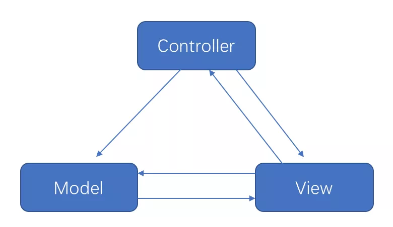
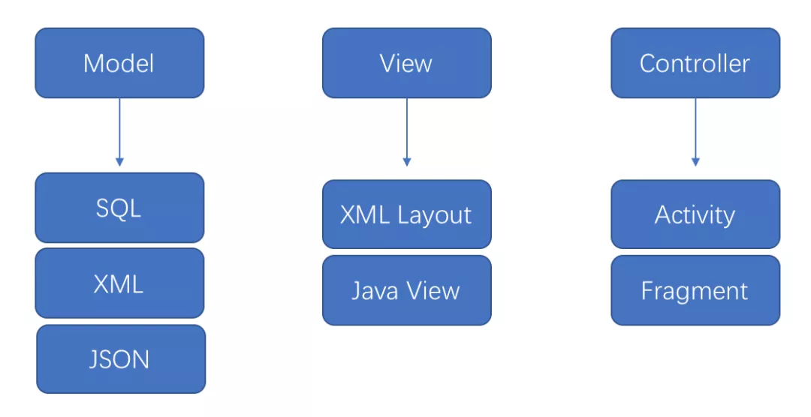
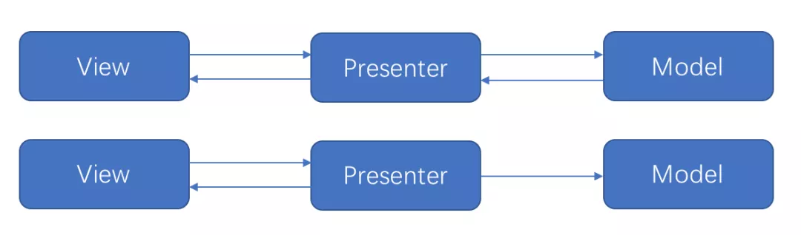
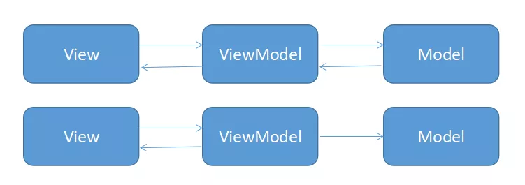
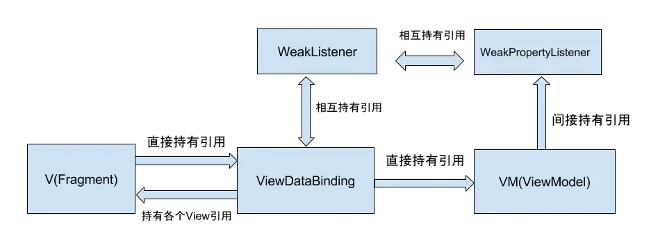
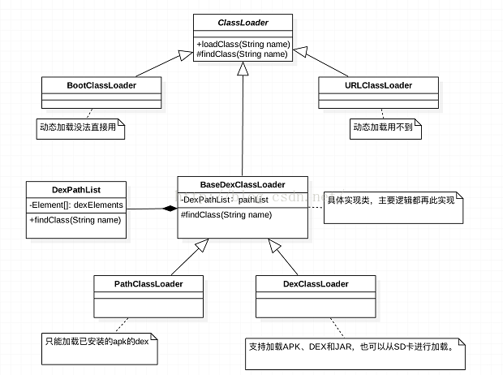
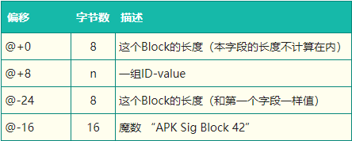

<!-- TOC -->

- [ART](#art)
    - [ART 功能](#art-功能)
    - [ART GC](#art-gc)
- [Apk 包体优化](#apk-包体优化)
    - [Apk 组成结构](#apk-组成结构)
    - [整体优化](#整体优化)
    - [资源优化](#资源优化)
    - [代码优化](#代码优化)
    - [.arsc文件优化](#arsc文件优化)
    - [lib目录优化](#lib目录优化)
- [签名机制](#签名机制)
    - [V1](#v1)
    - [V2](#v2)
- [Hook](#hook)
    - [基本流程](#基本流程)
    - [使用示例](#使用示例)
- [Proguard](#proguard)
    - [常用的自定义混淆规则](#常用的自定义混淆规则)
    - [aar中增加独立的混淆配置](#aar中增加独立的混淆配置)
    - [检查混淆和追踪异常](#检查混淆和追踪异常)
- [架构](#架构)
    - [MVC](#mvc)
    - [MVP](#mvp)
    - [MVVM](#mvvm)
- [DataBinding](#databinding)
    - [布局绑定原理](#布局绑定原理)
    - [架构](#架构)
    - [V和VM绑定](#V和VM绑定)
    - [VM回调通知V](#VM回调通知V)
- [NDK 开发](#ndk-开发)
    - [JNI 基础](#jni-基础)
    - [NDK 开发](#ndk-开发)
    - [CMake 构建 NDK 项目](#cmake-构建-ndk-项目)
    - [常用的 Android NDK 原生 API](#常用的-android-ndk-原生-api)
- [类加载器](#类加载器)
    - [双亲委托模式](#双亲委托模式)
    - [DexPathList](#dexpathlist)
    - [三种ClassLoader](#三种classloader)
- [热修复原理](#热修复原理)
- [多渠道打包](#多渠道打包)
    - [官方方式](#官方方式)
    - [美团原理](#美团原理)
- [JetPack](#jetpack)
- [RxJava/RxAndroid](#rxjavarxandroid)
    - [在安卓中使用](#在安卓中使用)

<!-- /TOC -->

# ART
ART 代表 Android Runtime，其处理应用程序执行的方式完全不同于 Dalvik，Dalvik 是依靠一个 Just-In-Time (JIT) 编译器去解释字节码。开发者编译后的应用代码需要通过一个解释器在用户的设备上运行，这一机制并不高效，但让应用能更容易在不同硬件和架构上运 行。ART 则完全改变了这套做法，在应用安装时就预编译字节码到机器语言，这一机制叫 Ahead-Of-Time (AOT）编译。在移除解释代码这一过程后，应用程序执行将更有效率，启动更快。

## ART 功能
### 预先 (AOT) 编译
ART 引入了预先编译机制，可提高应用的性能。ART 还具有比 Dalvik 更严格的安装时验证。在安装时，ART 使用设备自带的 dex2oat 工具来编译应用。该实用工具接受 DEX 文件作为输入，并为目标设备生成经过编译的应用可执行文件。该工具应能够顺利编译所有有效的 DEX 文件。

### 垃圾回收优化
垃圾回收 (GC) 可能有损于应用性能，从而导致显示不稳定、界面响应速度缓慢以及其他问题。ART 通过以下几种方式对垃圾回收做了优化：
- 只有一次（而非两次）GC 暂停
- 在 GC 保持暂停状态期间并行处理
- 在清理最近分配的短时对象这种特殊情况中，回收器的总 GC 时间更短
- 优化了垃圾回收的工效，能够更加及时地进行并行垃圾回收，这使得 GC_FOR_ALLOC 事件在典型用例中极为罕见
- 压缩 GC 以减少后台内存使用和碎片

### 开发和调试方面的优化
- 支持采样分析器
  
一直以来，开发者都使用 Traceview 工具（用于跟踪应用执行情况）作为分析器。虽然 Traceview 可提供有用的信息，但每次方法调用产生的开销会导致 Dalvik 分析结果出现偏差，而且使用该工具明显会影响运行时性能

ART 添加了对没有这些限制的专用采样分析器的支持，因而可更准确地了解应用执行情况，而不会明显减慢速度。KitKat 版本为 Dalvik 的 Traceview 添加了采样支持。


- 支持更多调试功能

ART 支持许多新的调试选项，特别是与监控和垃圾回收相关的功能。例如，查看堆栈跟踪中保留了哪些锁，然后跳转到持有锁的线程；询问指定类的当前活动的实例数、请求查看实例，以及查看使对象保持有效状态的参考；过滤特定实例的事件（如断点）等。

- 优化了异常和崩溃报告中的诊断详细信息
  
当发生运行时异常时，ART 会为您提供尽可能多的上下文和详细信息。ART 会提供 ``java.lang.ClassCastException``、``java.lang.ClassNotFoundException`` 和 ``java.lang.NullPointerException`` 的更多异常详细信息（较高版本的 Dalvik 会提供 ``java.lang.ArrayIndexOutOfBoundsException`` 和 ``java.lang.ArrayStoreException`` 的更多异常详细信息，这些信息现在包括数组大小和越界偏移量；ART 也提供这类信息）。

## ART GC
ART 有多个不同的 GC 方案，这些方案包括运行不同垃圾回收器。默认方案是 CMS（并发标记清除）方案，主要使用粘性 CMS 和部分 CMS。粘性 CMS 是 ART 的不移动分代垃圾回收器。它仅扫描堆中自上次 GC 后修改的部分，并且只能回收自上次 GC 后分配的对象。除 CMS 方案外，当应用将进程状态更改为察觉不到卡顿的进程状态（例如，后台或缓存）时，ART 将执行堆压缩。

除了新的垃圾回收器之外，ART 还引入了一种基于位图的新内存分配程序，称为 RosAlloc（插槽运行分配器）。此新分配器具有分片锁，当分配规模较小时可添加线程的本地缓冲区，因而性能优于 DlMalloc。

与 Dalvik 相比，ART CMS 垃圾回收计划在很多方面都有一定的改善：

- 与 Dalvik 相比，暂停次数从 2 次减少到 1 次。Dalvik 的第一次暂停主要是为了进行根标记，即在 ART 中进行并发标记，让线程标记自己的根，然后马上恢复运行。

- 与 Dalvik 类似，ART GC 在清除过程开始之前也会暂停 1 次。两者在这方面的主要差异在于：在此暂停期间，某些 Dalvik 环节在 ART 中并发进行。这些环节包括 java.lang.ref.Reference 处理、系统弱清除（例如，jni 弱全局等）、重新标记非线程根和卡片预清理。在 ART 暂停期间仍进行的阶段包括扫描脏卡片以及重新标记线程根，这些操作有助于缩短暂停时间。

- 相对于 Dalvik，ART GC 改进的最后一个方面是粘性 CMS 回收器增加了 GC 吞吐量。不同于普通的分代 GC，粘性 CMS 不移动。系统会将年轻对象保存在一个分配堆栈（基本上是 java.lang.Object 数组）中，而非为其设置一个专属区域。这样可以避免移动所需的对象以维持低暂停次数，但缺点是容易在堆栈中加入大量复杂对象图像而使堆栈变长。

ART GC 与 Dalvik 的另一个主要区别在于 ART GC 引入了移动垃圾回收器。使用移动 GC 的目的在于通过堆压缩来减少后台应用使用的内存。目前，触发堆压缩的事件是 ActivityManager 进程状态的改变。当应用转到后台运行时，它会通知 ART 已进入不再“感知”卡顿的进程状态。此时 ART 会进行一些操作（例如，压缩和监视器压缩），从而导致应用线程长时间暂停。目前正在使用的两个移动 GC 是同构空间压缩和半空间压缩。

- 半空间压缩将对象在两个紧密排列的碰撞指针空间之间进行移动。这种移动 GC 适用于小内存设备，因为它可以比同构空间压缩稍微多节省一点内存。额外节省出的空间主要来自紧密排列的对象，这样可以避免 RosAlloc/DlMalloc 分配器占用开销。由于 CMS 仍在前台使用，且不能从碰撞指针空间中进行收集，因此当应用在前台使用时，半空间还要再进行一次转换。这种情况并不理想，因为它可能引起较长时间的暂停。

- 同构空间压缩通过将对象从一个 RosAlloc 空间复制到另一个 RosAlloc 空间来实现。这有助于通过减少堆碎片来减少内存使用量。这是目前非低内存设备的默认压缩模式。相比半空间压缩，同构空间压缩的主要优势在于应用从后台切换到前台时无需进行堆转换。

# Apk 包体优化
## Apk 组成结构
| 文件/文件夹 | 作用/功能
|--|--
| res | 包含所有没有被编译到 .arsc 里面的资源文件
| lib | 引用库的文件夹
| assets | assets文件夹相比于 res 文件夹，还有可能放字体文件、预置数据和web页面等,通过 AssetManager 访问
| META_INF | 存放的是签名信息，用来保证 apk 包的完整性和系统的安全。在生成一个APK的时候，会对所有的打包文件做一个校验计算，并把结果放在该目录下面
| classes.dex | 包含编译后的应用程序源码转化成的dex字节码。APK 里面，可能会存在多个 dex 文件
| resources.arsc | 一些资源和标识符被编译和写入这个文件
| Androidmanifest.xml | 编译时，应用程序的 AndroidManifest.xml 被转化成二进制格式

## 整体优化
- 分离应用的独立模块，以插件的形式加载
- 解压APK，重新用 7zip 进行压缩
- 用 apksigner 签名工具 替代 java 提供的 jarsigner 签名工具

## 资源优化 
- 可以只用一套资源图片，一般采用 xhdpi 下的资源图片
- 通过扫描文件的 MD5 值，找出名字不同，内容相同的图片并删除
- 通过 Lint 工具扫描工程资源，移除无用资源
- 通过 Gradle 参数配置 shrinkResources=true
- 对 png 图片压缩
- 图片资源考虑采用 WebP 格式
- 避免使用帧动画，可使用 Lottie 动画库
- 优先考虑能否用 shape 代码、.9 图、svg 矢量图、VectorDrawable 类来替换传统的图片

## 代码优化
- 启用混淆以移除无用代码
- 剔除 R 文件
- 用注解替代枚举

## .arsc文件优化 
- 移除未使用的备用资源来优化 .arsc 文件
```groovy
android {
    defaultConfig {
        ...
        resConfigs "zh", "zh_CN", "zh_HK", "en"
    }
}
```

## lib目录优化
- 只提供对主流架构的支持，比如 arm，对于 mips 和 x86 架构可以考虑不提供支持
```groovy
android {
    defaultConfig {
        ...
        ndk {
            abiFilters  "armeabi-v7a"
        }
    }
}
```

# 签名机制
[详见](https://blog.csdn.net/freekiteyu/article/details/84849651)

使用RSA加密方式
* 公钥加密，私钥解密的过程，称为“加密”。公钥加密后只有私钥持有者才能解密
* 私钥加密，公钥解密的过程，称为“签名”。任何持有公钥的人都能解密，却导致加密者不能否认，因为公钥能解密则说明一定是私钥加密的
## V1

### 签名过程：
1. MANIFEST.MF：保存每个文件的SHA值BASE64后的结果
2. CERT.SF：对MANIFEST.MF的头部、整个文件、条目再进行一次SHA后的BASE64计算
3. CERT.RSA对CERT.SF用私钥签名，并将公钥一同写入该文件
4. 将保存至META-INF文件夹中（META-INF文件夹不参与运算）
### 校验过程：
1. 检查 APK 中包含的所有文件，对应的摘要值与 MANIFEST.MF 文件中记录的值一致。
2. 使用证书文件（RSA 文件）检验签名文件（SF 文件）没有被修改过。
3. 使用签名文件（SF 文件）检验 MF 文件没有被修改过。
### 存在的问题：
* 慢，文件多所以慢
* 不安全，因为META-INF文件夹不参与运算，一些快速批量打包方案就选择在这个目录中添加渠道文件


## V2
从Android7.0开始

就是把 APK 按照 1M 大小分割，分别计算这些分段的摘要，最后把这些分段的摘要在进行计算得到最终的摘要也就是 APK 的摘要。然后将 APK 的摘要 + 数字证书 + 其他属性生成签名数据写入到 APK Signing Block 区块。

# Hook
## 基本流程
1、根据需求确定 要 hook 的对象  
2、寻找要hook的对象的持有者，拿到要 hook 的对象  
3、定义“要 hook 的对象”的代理类，并且创建该类的对象  
4、使用上一步创建出来的对象，替换掉要 hook 的对象

## 使用示例
```java
/**
* hook的核心代码
* 这个方法的唯一目的：用自己的点击事件，替换掉 View 原来的点击事件
*
* @param view hook的范围仅限于这个view
*/
@SuppressLint({"DiscouragedPrivateApi", "PrivateApi"})
public static void hook(Context context, final View view) {//
    try {
        // 反射执行View类的getListenerInfo()方法，拿到v的mListenerInfo对象，这个对象就是点击事件的持有者
        Method method = View.class.getDeclaredMethod("getListenerInfo");
        method.setAccessible(true);//由于getListenerInfo()方法并不是public的，所以要加这个代码来保证访问权限
        Object mListenerInfo = method.invoke(view);//这里拿到的就是mListenerInfo对象，也就是点击事件的持有者

        // 要从这里面拿到当前的点击事件对象
        Class<?> listenerInfoClz = Class.forName("android.view.View$ListenerInfo");// 这是内部类的表示方法
        Field field = listenerInfoClz.getDeclaredField("mOnClickListener");
        final View.OnClickListener onClickListenerInstance = (View.OnClickListener) field.get(mListenerInfo);//取得真实的mOnClickListener对象

        // 2. 创建我们自己的点击事件代理类
        //   方式1：自己创建代理类
        //   ProxyOnClickListener proxyOnClickListener = new ProxyOnClickListener(onClickListenerInstance);
        //   方式2：由于View.OnClickListener是一个接口，所以可以直接用动态代理模式
        // Proxy.newProxyInstance的3个参数依次分别是：
        // 本地的类加载器;
        // 代理类的对象所继承的接口（用Class数组表示，支持多个接口）
        // 代理类的实际逻辑，封装在new出来的InvocationHandler内
        Object proxyOnClickListener = Proxy.newProxyInstance(context.getClass().getClassLoader(), new Class[]{View.OnClickListener.class}, new InvocationHandler() {
            @Override
            public Object invoke(Object proxy, Method method, Object[] args) throws Throwable {
                Log.d("HookSetOnClickListener", "点击事件被hook到了");//加入自己的逻辑
                return method.invoke(onClickListenerInstance, args);//执行被代理的对象的逻辑
            }
        });
        // 3. 用我们自己的点击事件代理类，设置到"持有者"中
        field.set(mListenerInfo, proxyOnClickListener);
    } catch (Exception e) {
        e.printStackTrace();
    }
}

// 自定义代理类
static class ProxyOnClickListener implements View.OnClickListener {
    View.OnClickListener oriLis;

    public ProxyOnClickListener(View.OnClickListener oriLis) {
        this.oriLis = oriLis;
    }

    @Override
    public void onClick(View v) {
        Log.d("HookSetOnClickListener", "点击事件被hook到了");
        if (oriLis != null) {
            oriLis.onClick(v);
        }
    }
}
```

# Proguard
Proguard 具有以下三个功能：
- 压缩（Shrink）: 检测和删除没有使用的类，字段，方法和特性
- 优化（Optimize） : 分析和优化Java字节码
- 混淆（Obfuscate）: 使用简短的无意义的名称，对类，字段和方法进行重命名

##  常用的自定义混淆规则
```xml
# 通配符*，匹配任意长度字符，但不含包名分隔符(.)
# 通配符**，匹配任意长度字符，并且包含包名分隔符(.)

# 不混淆某个类
-keep public class com.jasonwu.demo.Test { *; }

# 不混淆某个包所有的类
-keep class com.jasonwu.demo.test.** { *; }

# 不混淆某个类的子类
-keep public class * com.jasonwu.demo.Test { *; }

# 不混淆所有类名中包含了 ``model`` 的类及其成员
-keep public class **.*model*.** {*;}

# 不混淆某个接口的实现
-keep class * implements com.jasonwu.demo.TestInterface { *; }

# 不混淆某个类的构造方法
-keepclassmembers class com.jasonwu.demo.Test { 
  public <init>(); 
}

# 不混淆某个类的特定的方法
-keepclassmembers class com.jasonwu.demo.Test { 
  public void test(java.lang.String); 
}
```


## aar中增加独立的混淆配置
``build.gralde``
```gradle
android {
    ···
    defaultConfig {
        ···
        consumerProguardFile 'proguard-rules.pro'
    }
    ···
}
```

## 检查混淆和追踪异常
开启 Proguard 功能，则每次构建时 ProGuard 都会输出下列文件：

- dump.txt  
说明 APK 中所有类文件的内部结构。

- mapping.txt  
提供原始与混淆过的类、方法和字段名称之间的转换。

- seeds.txt  
列出未进行混淆的类和成员。

- usage.txt  
列出从 APK 移除的代码。

这些文件保存在 /build/outputs/mapping/release/ 中。我们可以查看 seeds.txt 里面是否是我们需要保留的，以及 usage.txt 里查看是否有误删除的代码。 mapping.txt 文件很重要，由于我们的部分代码是经过重命名的，如果该部分出现 bug，对应的异常堆栈信息里的类或成员也是经过重命名的，难以定位问题。我们可以用 retrace 脚本（在 Windows 上为 retrace.bat；在 Mac/Linux 上为 retrace.sh）。它位于 /tools/proguard/ 目录中。该脚本利用 mapping.txt 文件和你的异常堆栈文件生成没有经过混淆的异常堆栈文件,这样就可以看清是哪里出问题了。使用 retrace 工具的语法如下：

```shell
retrace.bat|retrace.sh [-verbose] mapping.txt [<stacktrace_file>]
```

# 架构
## MVC


在 Android 中，三者的关系如下：



由于在 Android 中 xml 布局的功能性太弱，所以 Activity 承担了绝大部分的工作，所以在 Android 中 mvc 更像：


总结：
- 具有一定的分层，model 解耦，controller 和 view 并没有解耦
- controller 和 view 在 Android 中无法做到彻底分离，Controller 变得臃肿不堪
- 易于理解、开发速度快、可维护性高

## MVP


通过引入接口 BaseView，让相应的视图组件如 Activity，Fragment去实现 BaseView，把业务逻辑放在 presenter 层中，弱化 Model 只有跟 view 相关的操作都由 View 层去完成。

总结：
- 彻底解决了 MVC 中 View 和 Controller 傻傻分不清楚的问题
- 但是随着业务逻辑的增加，一个页面可能会非常复杂，UI 的改变是非常多，会有非常多的 case，这样就会造成 View 的接口会很庞大
- 更容易单元测试

## MVVM


在 MVP 中 View 和 Presenter 要相互持有，方便调用对方，而在 MVP 中 View 和 ViewModel 通过 Binding 进行关联，他们之前的关联处理通过  DataBinding 完成。

总结：
- 很好的解决了 MVC 和 MVP 的问题
- 视图状态较多，ViewModel 的构建和维护的成本都会比较高
- 但是由于数据和视图的双向绑定，导致出现问题时不太好定位来源

# DataBinding
[详情](https://www.jianshu.com/p/c4f5411cb0ae)

## 布局绑定原理
DataBinding只是对原有API的封装。
在编译时对跟布局增加了`layout/文件名驼峰命名_0`每个使用了绑定的View增加一个`android:tag="binding_1"`

初始化View时会检查跟布局的tag是否是固定的值。从`mapBindings`中获取对应的值并将每一个强转成对应的View类型清空tag。`mapBindings`则是递归把所有view存起来。至此就将所有View绑定到ViewBinging中了。

绑定layout的代码有两种，Acitivity里是DataBindingUtil.setContentView，Fragment里是DataBindingUtil.inflate，两个方法调用后都会走到DataBindingUtil.bind这个方法

## V和VM绑定
`binding.setVariable`或者`binding.setViewModel`，最终还是会调用`setViewModel`。
setVariable方法是根据xml中data定义的name生成的，要传递一个BR中的id值，BR是自动生成的：
1. xml中中设置variable的name属性
2. VM继承BaseObservable，将某个成员变量加上@Bindable注解
3. VM继承BaseObservable，将get,set,is开头的方法加上@Bindable注解
引用关系：


## VM回调通知V
当VM层调用notifyPropertyChanged方法时，最终在ViewDataBinding的executeBindings方法中处理逻辑

## 架构


# NDK 开发
> NDK 全称是 Native Development Kit，是一组可以让你在 Android 应用中编写实现 C/C++ 的工具，可以在项目用自己写源代码构建，也可以利用现有的预构建库。

使用 NDK 的使用目的有：
- 从设备获取更好的性能以用于计算密集型应用，例如游戏或物理模拟  
- 重复使用自己或其他开发者的 C/C++ 库，便利于跨平台。  
- NDK 集成了譬如 OpenSL、Vulkan 等 API 规范的特定实现，以实现在 java 层无法做到的功能如提升音频性能等  
- 增加反编译难度

## JNI 基础
### 数据类型
- 基本数据类型
  
| Java 类型 | Native 类型 | 符号属性 | 字长
|--|--|--|--
| boolean | jboolean | 无符号 | 8位
| byte | jbyte | 无符号 | 8位
| char | jchar | 无符号 | 16位
| short | jshort | 有符号 | 16位
| int | jnit | 有符号 | 32位
| long | jlong | 有符号 | 64位
| float | jfloat | 有符号 | 32位
| double | jdouble | 有符号 | 64位

- 引用数据类型

| Java 引用类型	| Native 类型 | Java 引用类型 | Native 类型
|--|--|--|--
| All objects | jobject | char[] | jcharArray
| java.lang.Class | jclass | short[] | jshortArray
| java.lang.String | jstring | int[] | jintArray
| Object[] | jobjectArray | long[] | jlongArray
| boolean[] | jbooleanArray | float[] | jfloatArray
| byte[] | jbyteArray | double[] | jdoubleArray
| java.lang.Throwable | jthrowable	

### String 字符串函数操作
| JNI 函数 | 描述
|--|--
| GetStringChars / ReleaseStringChars | 获得或释放一个指向 Unicode 编码的字符串的指针（指 C/C++ 字符串）
| GetStringUTFChars / ReleaseStringUTFChars | 获得或释放一个指向 UTF-8 编码的字符串的指针（指 C/C++ 字符串）
| GetStringLength | 返回 Unicode 编码的字符串的长度
| getStringUTFLength | 返回 UTF-8 编码的字符串的长度
| NewString | 将 Unicode 编码的 C/C++ 字符串转换为 Java 字符串
| NewStringUTF | 将 UTF-8 编码的 C/C++ 字符串转换为 Java 字符串
| GetStringCritical / ReleaseStringCritical | 获得或释放一个指向字符串内容的指针(指 Java 字符串)
| GetStringRegion | 获取或者设置 Unicode 编码的字符串的指定范围的内容
| GetStringUTFRegion | 获取或者设置 UTF-8 编码的字符串的指定范围的内容

### 常用 JNI 访问 Java 对象方法
``MyJob.java``
```java
package com.example.myjniproject;

public class MyJob {

    public static String JOB_STRING = "my_job";
    private int jobId;

    public MyJob(int jobId) {
        this.jobId = jobId;
    }

    public int getJobId() {
        return jobId;
    }
}
```
``native-lib.cpp``
```c++
#include <jni.h>

extern "C"
JNIEXPORT jint JNICALL
Java_com_example_myjniproject_MainActivity_getJobId(JNIEnv *env, jobject thiz, jobject job) {

    // 根据实力获取 class 对象
    jclass jobClz = env->GetObjectClass(job);
    // 根据类名获取 class 对象
    jclass jobClz = env->FindClass("com/example/myjniproject/MyJob");

    // 获取属性 id
    jfieldID fieldId = env->GetFieldID(jobClz, "jobId", "I");
    // 获取静态属性 id
    jfieldID sFieldId = env->GetStaticFieldID(jobClz, "JOB_STRING", "Ljava/lang/String;");

    // 获取方法 id
    jmethodID methodId = env->GetMethodID(jobClz, "getJobId", "()I");
    // 获取构造方法 id
    jmethodID  initMethodId = env->GetMethodID(jobClz, "<init>", "(I)V");

    // 根据对象属性 id 获取该属性值
    jint id = env->GetIntField(job, fieldId);
    // 根据对象方法 id 调用该方法
    jint id = env->CallIntMethod(job, methodId);

    // 创建新的对象
    jobject newJob = env->NewObject(jobClz, initMethodId, 10);

    return id;
}
```

## NDK 开发
### 基础开发流程
- 在 java 中声明 native 方法
```java
public class MainActivity extends AppCompatActivity {

    // Used to load the 'native-lib' library on application startup.
    static {
        System.loadLibrary("native-lib");
    }

    @Override
    protected void onCreate(Bundle savedInstanceState) {
        super.onCreate(savedInstanceState);
        setContentView(R.layout.activity_main);

        Log.d("MainActivity", stringFromJNI());
    }

    private native String stringFromJNI();
}
```

- 在 ``app/src/main`` 目录下新建 cpp 目录，新建相关 cpp 文件，实现相关方法（AS 可用快捷键快速生成）

``native-lib.cpp``
```
#include <jni.h>

extern "C" JNIEXPORT jstring JNICALL
Java_com_example_myjniproject_MainActivity_stringFromJNI(
        JNIEnv *env,
        jobject /* this */) {
    std::string hello = "Hello from C++";
    return env->NewStringUTF(hello.c_str());
}
```

>- 函数名的格式遵循遵循如下规则：Java_包名_类名_方法名。
>- extern "C" 指定采用 C 语言的命名风格来编译，否则由于 C 与 C++ 风格不同，导致链接时无法找到具体的函数
>- JNIEnv*：表示一个指向 JNI 环境的指针，可以通过他来访问 JNI 提供的接口方法
>- jobject：表示 java 对象中的 this
>- JNIEXPORT 和 JNICALL：JNI 所定义的宏，可以在 jni.h 头文件中查找到

- 通过 CMake 或者 ndk-build 构建动态库

### System.loadLibrary()
``java/lang/System.java``:
```java
@CallerSensitive
public static void load(String filename) {
    Runtime.getRuntime().load0(Reflection.getCallerClass(), filename);
}
```

- 调用 ``Runtime`` 相关 native 方法

``java/lang/Runtime.java``:
```java
private static native String nativeLoad(String filename, ClassLoader loader, Class<?> caller);
```

- native 方法的实现如下：

``dalvik/vm/native/java_lang_Runtime.cpp``:
```cpp
static void Dalvik_java_lang_Runtime_nativeLoad(const u4* args,
    JValue* pResult)
{
    ···
    bool success;

    assert(fileNameObj != NULL);
    // 将 Java 的 library path String 转换到 native 的 String
    fileName = dvmCreateCstrFromString(fileNameObj);

    success = dvmLoadNativeCode(fileName, classLoader, &reason);
    if (!success) {
        const char* msg = (reason != NULL) ? reason : "unknown failure";
        result = dvmCreateStringFromCstr(msg);
        dvmReleaseTrackedAlloc((Object*) result, NULL);
    }
    ···
}
```

- ``dvmLoadNativeCode`` 函数实现如下：

``dalvik/vm/Native.cpp``
```cpp
bool dvmLoadNativeCode(const char* pathName, Object* classLoader,
        char** detail)
{
    SharedLib* pEntry;
    void* handle;
    ···
    *detail = NULL;

    // 如果已经加载过了，则直接返回 true
    pEntry = findSharedLibEntry(pathName);
    if (pEntry != NULL) {
        if (pEntry->classLoader != classLoader) {
            ···
            return false;
        }
        ···
        if (!checkOnLoadResult(pEntry))
            return false;
        return true;
    }

    Thread* self = dvmThreadSelf();
    ThreadStatus oldStatus = dvmChangeStatus(self, THREAD_VMWAIT);
    // 把.so mmap 到进程空间，并把 func 等相关信息填充到 soinfo 中
    handle = dlopen(pathName, RTLD_LAZY);
    dvmChangeStatus(self, oldStatus);
    ···
    // 创建一个新的 entry
    SharedLib* pNewEntry;
    pNewEntry = (SharedLib*) calloc(1, sizeof(SharedLib));
    pNewEntry->pathName = strdup(pathName);
    pNewEntry->handle = handle;
    pNewEntry->classLoader = classLoader;
    dvmInitMutex(&pNewEntry->onLoadLock);
    pthread_cond_init(&pNewEntry->onLoadCond, NULL);
    pNewEntry->onLoadThreadId = self->threadId;

    // 尝试添加到列表中
    SharedLib* pActualEntry = addSharedLibEntry(pNewEntry);

    if (pNewEntry != pActualEntry) {
        ···
        freeSharedLibEntry(pNewEntry);
        return checkOnLoadResult(pActualEntry);
    } else {
        ···
        bool result = true;
        void* vonLoad;
        int version;
        // 调用该 so 库的 JNI_OnLoad 方法
        vonLoad = dlsym(handle, "JNI_OnLoad");
        if (vonLoad == NULL) {
            ···
        } else {
            // 调用 JNI_Onload 方法，重写类加载器。
            OnLoadFunc func = (OnLoadFunc)vonLoad;
            Object* prevOverride = self->classLoaderOverride;

            self->classLoaderOverride = classLoader;
            oldStatus = dvmChangeStatus(self, THREAD_NATIVE);
            ···
            version = (*func)(gDvmJni.jniVm, NULL);
            dvmChangeStatus(self, oldStatus);
            self->classLoaderOverride = prevOverride;

            if (version != JNI_VERSION_1_2 && version != JNI_VERSION_1_4 &&
                version != JNI_VERSION_1_6)
            {
                ···
                result = false;
            } else {
                ···
            }
        }

        if (result)
            pNewEntry->onLoadResult = kOnLoadOkay;
        else
            pNewEntry->onLoadResult = kOnLoadFailed;

        pNewEntry->onLoadThreadId = 0;

        // 释放锁资源 
        dvmLockMutex(&pNewEntry->onLoadLock);
        pthread_cond_broadcast(&pNewEntry->onLoadCond);
        dvmUnlockMutex(&pNewEntry->onLoadLock);
        return result;
    }
}
```

<!-- ### native 方法调用原理
- 虚拟机调用一个方法时，发现如果这是一个 native 方法，则使用 Method 对象中的nativeFunc 函数指针对象调用。

``dalvik2/vm/interp/Stack.cpp``:
```cpp
Object* dvmInvokeMethod(Object* obj, const Method* method,
    ArrayObject* argList, ArrayObject* params, ClassObject* returnType,
    bool noAccessCheck)
{
    ···
    if (dvmIsNativeMethod(method)) {
        TRACE_METHOD_ENTER(self, method);
        (*method->nativeFunc)((u4*)self->interpSave.curFrame, &retval, method, self);
        TRACE_METHOD_EXIT(self, method);
    } else {
        dvmInterpret(self, method, &retval);
    }
    ···
}
``` -->

## CMake 构建 NDK 项目
> CMake 是一个开源的跨平台工具系列，旨在构建，测试和打包软件，从 Android Studio 2.2 开始，Android Sudio 默认地使用 CMake 与 Gradle 搭配使用来构建原生库。

启动方式只需要在 ``app/build.gradle`` 中添加相关：
```groovy
android {
    ···
    defaultConfig {
        ···
        externalNativeBuild {
            cmake {
                cppFlags ""
            }
        }

        ndk {
            abiFilters 'arm64-v8a', 'armeabi-v7a'
        }
    }
    ···
    externalNativeBuild {
        cmake {
            path "CMakeLists.txt"
        }
    }
}
```

然后在对应目录新建一个 ``CMakeLists.txt`` 文件：
```txt
# 定义了所需 CMake 的最低版本
cmake_minimum_required(VERSION 3.4.1)

# add_library() 命令用来添加库
# native-lib 对应着生成的库的名字
# SHARED 代表为分享库
# src/main/cpp/native-lib.cpp 则是指明了源文件的路径。
add_library( # Sets the name of the library.
        native-lib

        # Sets the library as a shared library.
        SHARED

        # Provides a relative path to your source file(s).
        src/main/cpp/native-lib.cpp)

# find_library 命令添加到 CMake 构建脚本中以定位 NDK 库，并将其路径存储为一个变量。
# 可以使用此变量在构建脚本的其他部分引用 NDK 库
find_library( # Sets the name of the path variable.
        log-lib

        # Specifies the name of the NDK library that
        # you want CMake to locate.
        log)

# 预构建的 NDK 库已经存在于 Android 平台上，因此，无需再构建或将其打包到 APK 中。
# 由于 NDK 库已经是 CMake 搜索路径的一部分，只需要向 CMake 提供希望使用的库的名称，并将其关联到自己的原生库中

# 要将预构建库关联到自己的原生库
target_link_libraries( # Specifies the target library.
        native-lib

        # Links the target library to the log library
        # included in the NDK.
        ${log-lib})
···
```
- [CMake 命令详细信息文档](https://cmake.org/cmake/help/latest/manual/cmake-commands.7.html)

## 常用的 Android NDK 原生 API
| 支持 NDK 的 API 级别 | 关键原生 API | 包括
|--|--|--
| 3 | Java 原生接口 | 	#include <jni.h>
| 3 | Android 日志记录 API	| #include <android/log.h>
| 5 | OpenGL ES 2.0 | #include <GLES2/gl2.h><br>#include <GLES2/gl2ext.h>
| 8 | Android 位图 API | #include <android/bitmap.h>
| 9 | OpenSL ES | #include <SLES/OpenSLES.h><br>#include <SLES/OpenSLES_Platform.h><br>#include <SLES/OpenSLES_Android.h><br>#include <SLES/OpenSLES_AndroidConfiguration.h>
| 9 | 原生应用 API | #include <android/rect.h><br>#include <android/window.h><br>#include<android/native_activity.h><br>···
| 18 | OpenGL ES 3.0 | #include <GLES3/gl3.h><br>#include <GLES3/gl3ext.h>
| 21 | 原生媒体 API | #include <media/NdkMediaCodec.h><br>#include <media/NdkMediaCrypto.h><br>···
| 24 | 原生相机 API | #include <camera/NdkCameraCaptureSession.h><br>#include <camera/NdkCameraDevice.h><br>···
| ···

# 类加载器


## 双亲委托模式
某个特定的类加载器在接到加载类的请求时，首先将加载任务委托给父类加载器，依次递归，如果父类加载器可以完成类加载任务，就成功返回；只有父类加载器无法完成此加载任务时，才自己去加载。

因为这样可以避免重复加载，当父亲已经加载了该类的时候，就没有必要子 ClassLoader 再加载一次。如果不使用这种委托模式，那我们就可以随时使用自定义的类来动态替代一些核心的类，存在非常大的安全隐患。

## DexPathList
DexClassLoader 重载了 ``findClass`` 方法，在加载类时会调用其内部的 DexPathList 去加载。DexPathList 是在构造 DexClassLoader 时生成的，其内部包含了 DexFile。

## 三种ClassLoader
Java中的ClassLoader是加载class文件，而Android中的虚拟机无论是dvm还是art都只能识别dex文件。因此Java中的ClassLoader在Android中不适用。Android中的`java.lang.ClassLoader`这个类也不同于Java中的`java.lang.ClassLoader`。
Android中的ClassLoader类型也可分为系统ClassLoader和自定义ClassLoader。其中系统ClassLoader包括3种分别是：

`BootClassLoader`，Android系统启动时会使用BootClassLoader来预加载常用类，与Java中的Bootstrap ClassLoader不同的是，它并不是由C/C++代码实现，而是由Java实现的。BootClassLoader是ClassLoader的一个内部类。

`PathClassLoader`，全名是`dalvik/system.PathClassLoader`，可以加载已经安装的Apk，也就是/data/app/package 下的apk文件，也可以加载/vendor/lib, /system/lib下的nativeLibrary。

`DexClassLoader`，全名是`dalvik/system.DexClassLoader`，可以加载一个未安装的apk文件。

``DexPathList.java``
```java
···
public Class findClass(String name) {
    for (Element element : dexElements) {
        DexFile dex = element.dexFile;
        if (dex != null) {
            Class clazz = dex.loadClassBinaryName(name, definingContext);
            if (clazz != null) {
                return clazz;
            }
        }
    }
    return null;
}
···
```

# 热修复原理
最终是通过遍历`DexPathList`的`dexElements`数组进行类的查找加载，当找到类就返回；

`dexElements`数组的每个元素都代表着一个dex文件，所以为了让补丁包中要替换的类抢先于有bug的类被加载，就需要将补丁包dex插入到dexElements数组的头部。

# 多渠道打包
## 官方方式
AndroidManifest中添加渠道标识
```
<meta-data
    android:name="CHANNEL_ID"
    android:value="${CHANNEL_VALUE}" />
```
定义所有渠道
```
flavorDimensions "official","test"
```
配置渠道
```
productFlavors {
    // 官方渠道
    "official" {
        dimension "official"
        //渠道标识
        manifestPlaceholders = [CHANNEL_VALUE: "1000"]
    }
}
```
对不同的渠道使用不同的签名
```
signingConfigs {
    official {
        storeFile file('./official.jks')
        storePassword '123456'
        keyAlias 'key0'
        keyPassword '123456'
    }
}
```
获取渠道号
```java
ApplicationInfo appInfo = null;
String channelIdStr = "";
try {
    appInfo = this.getPackageManager().getApplicationInfo(getPackageName(), PackageManager.GET_META_DATA);
    Object channelId = appInfo.metaData.get("CHANNEL_ID");
    channelIdStr = TextUtils.isEmpty(channelId.toString()) ? "1000" : channelId.toString();
} catch (PackageManager.NameNotFoundException e) {
    channelIdStr = "1000";
    e.printStackTrace();
}
```

## 美团原理
V2签名将APK分成4个区域，其中134受到保护

区块2中的内容：



ID-value是个数组，所以可以在这里添加信息

1. 对新的应用签名方案生成的APK包中的ID-value进行扩展，提供自定义ID－value（渠道信息），并保存在APK中
2. 而APK在安装过程中进行的签名校验，是忽略我们添加的这个ID-value的，这样就能正常安装了
3. 在App运行阶段，可以通过ZIP的EOCD（End of central directory）、Central directory等结构中的信息（会涉及ZIP格式的相关知识，这里不做展开描述）找到我们自己添加的ID-value，从而实现获取渠道信息的功能

# JetPack
旨在提供兼容并规范的代码库

AndroidX、CameraX 均属于属于JetPack

# RxJava/RxAndroid
RxJava使用的是观察者模式，其中有两个关键的接口：Observable 和 Observer，当Observable（被观察的对象）状态改变，所有subscribed（订阅）的Observer（观察者）会收到一个通知。

在Observable的接口中有一个方法 subscribe() ，这样Observer 可以调用来进行订阅。
同样，在Observer 接口中有三个方法，会被Observable 回调：

* onNext(T value) 提供了一个 T 类型的item给Observer
* onComplete() 在Observable发送items结束后通知Observer
* onError(Throwable e) 当Observable发生错误时通知Observer

## 在安卓中使用
使用`compose`来添加一个调度转换器
* unsubscribeOn(Schedulers.io()) // 指定取消订阅的调度器
* subscribeOn(Schedulers.io()) // 指定上游发送事件的调度器(只有第一次指定有效)
* observeOn(AndroidSchedulers.mainThread()) // 指定下游接收事件的调度器(每次指定都有效)
* onErrorResumeNext() // 指定异常处理器
```java
public abstract class BaseObserver<T> extends AtomicReference<Disposable> implements Observer<T>, Disposable {

    @Override
    public void onSubscribe(@io.reactivex.annotations.NonNull Disposable d) {
        if (DisposableHelper.setOnce(this, d)) {
            try {
                onStart();
            } catch (Throwable ex) {
                Exceptions.throwIfFatal(ex);
                d.dispose();
                onError(ex);
            }
        }
    }

    @Override
    public void onNext(@io.reactivex.annotations.NonNull T t) {
        if (!isDisposed()) {
            try {
                doOnNext(t);
            } catch (Throwable e) {
                Exceptions.throwIfFatal(e);
                get().dispose();
                onError(e);
            }
        }
    }

    @Override
    public void onError(@io.reactivex.annotations.NonNull Throwable t) {
        if (!isDisposed()) {
            lazySet(DisposableHelper.DISPOSED);
            try {
                onStop();
                if (t != null) {
                    doOnError(t);
                }
            } catch (Throwable e) {
                Exceptions.throwIfFatal(e);
                RxJavaPlugins.onError(new CompositeException(t, e));
            }
        } else {
            RxJavaPlugins.onError(t);
        }
    }

    @Override
    public void onComplete() {
        if (!isDisposed()) {
            lazySet(DisposableHelper.DISPOSED);
            try {
                onStop();
            } catch (Throwable e) {
                Exceptions.throwIfFatal(e);
                RxJavaPlugins.onError(e);
            }
        }
    }

    @Override
    public void dispose() {
        DisposableHelper.dispose(this);
    }

    @Override
    public boolean isDisposed() {
        return get() == DisposableHelper.DISPOSED;
    }

    public boolean disposable(@NonNull CompositeDisposable disposable) {
        return disposable.add(this);
    }

    protected void onStart() {
    }

    protected void onStop() {
    }

    protected abstract void doOnNext(@NonNull T t);

    protected abstract void doOnError(@NonNull Throwable t);

}
```

# Zygote
[现在看似乎有些早了](https://jsonchao.github.io/categories/Android%E6%A0%B8%E5%BF%83%E6%BA%90%E7%A0%81%E5%88%86%E6%9E%90/)

在Android系统中，zygote是一个native进程，是Android系统上所有应用进程的父进程，我们系统上app的进程都是由这个zygote分裂出来的。zygote则是由Linux系统用户空间的第一个进程——init进程，通过fork的方式创建的。
zygote进程做了两个重要的事情：
1. 不断接收其它进程的信号，随时创建子进程（即app进程）
2. 创建了嫡长子 —— system_server进程

zygote进程启动之后，首先创建了Java虚拟机，该虚拟机是Android系统启动后的第一个虚拟机，然后注册JNI调用，接着调用了Java层的ZygoteInit类的main函数，进入了Java的世界。接着，Java世界的ZygoteInit开始了zygote的工作，工作的步骤按顺序如下：

1. 建立一个Socket服务端，监听客户端的连接，用于IPC通信。
这里是为了响应创建子进程的请求，当收到请求时，zygote执行一系列操作，最后通过fork创建子进程，请求是在第4步启动循环后处理的。
举个例子，应用程序A通过startActivity启动了应用程序B的Activity，但此时B进程并未启动，那么，A将利用Binder机制向系统的ActivityManagerService服务发送启动Activity的请求，而ActivityManagerService服务驻留在system_server进程，因此A将把请求发往system_server进程，system_server进程进而新建一个LocalSocket与zygote的ServerSocket进行连接，向zygote进程发送启动子进程的请求，并带上参数“android.app.ActivityThread”，zygote收到请求后通过fork的方式启动了子进程，并执行子进程的android.app.ActivityThread类中的main()函数，完成了应用程序B的进程的创建。

2. 预加载类和资源
预加载类：系统有一个文件列表，保存着需要由zygote进行预加载的类的全路径，这些类是framework/base/tools/preload工具判断的加载时间超过1250微秒的类，zygote通过Class.forName()的方式进行预加载。这个列表不小，每一行一个类，超过了1000行，这也是Android系统启动慢的原因之一。
zygote预加载类的一个好处是：预加载一次类后，在通过fork创建子进程时，只需要做一个复制即可，这样便加快了子进程的启动速度。
预加载资源：主要是加载framework-res.apk中的资源，在UI编程中常使用的com.android.R.XXX资源，是系统默认的资源，它们就是由zygote加载的。

3. 通过fork的方式，启动system_server进程
system_server进程是zygote进程创建的第一个进程，也就是“嫡长子”，其中驻留着Android系统多个重要的服务，比如EntropyService、PowerManagerService、BatteryService、WindowManagerService、ActivityManagerService等。
zygote进程内部通过函数startSystemServer()启动system_server进程，该函数采用了抛出异常后在异常捕获处继续执行的技巧，使得system_server进程跳过了zygote进程后续的步骤进入system_server的Java世界，这些步骤包括使得Zygote进入无限循环的runSelectLoopMode()方法。
system_server的一个重要的特点是，它支持使用Binder进行进程间通信，它已经进入了Binder的世界，不用跟zygote进程一样使用Socket。
另一个特点是，system_server是和zygote共存亡的，只要system_server被杀死，zygote也会把自己杀掉，这就导致了系统的重启。

4. 通过调用runSelectLoopMode()方法，进入无限循环，等待客户端的连接请求，并处理请求。
这里可以发现，无论是zygote进程，还是system_server进程，或者是zygote分裂的应用子进程，他们的模式都是在进行必要的native初始化后，随即调用Java层某个类的main函数，从而进入Java的世界，主要逻辑都是在Java层完成。比如zygote进程的ZygoteInit.java类、system_server进程的SystemServer.java类、应用子进程的ActivityThread.java类

关于fork：
只在Unix系的系统中有这个函数，window系统是没有的。它是一个系统调用，调用它之后，可以创建一个与当前进程一模一样的进程，包括相同的进程上下文、堆栈地址、内存信息、PCB等。调用fork的进程称为父进程，fork将返回子进程的pid，而新的进程称为子进程，子进程将从fork()处开始执行，并且fork将返回0。
```c
#include <unistd.h>
#include <stdio.h>
#include <stdlib.h>
int main() {
    pid_t fpid;
    int r = rand();
    printf("before fork\n");
    fpid = fork();
    printf("fpid:%d, rand: %d\n", fpid, r);
    return 0;
}
```
以上代码的运行结果是：
before fork

fpid：18570，rand：1804289383

fpid：0，rand：1804289383